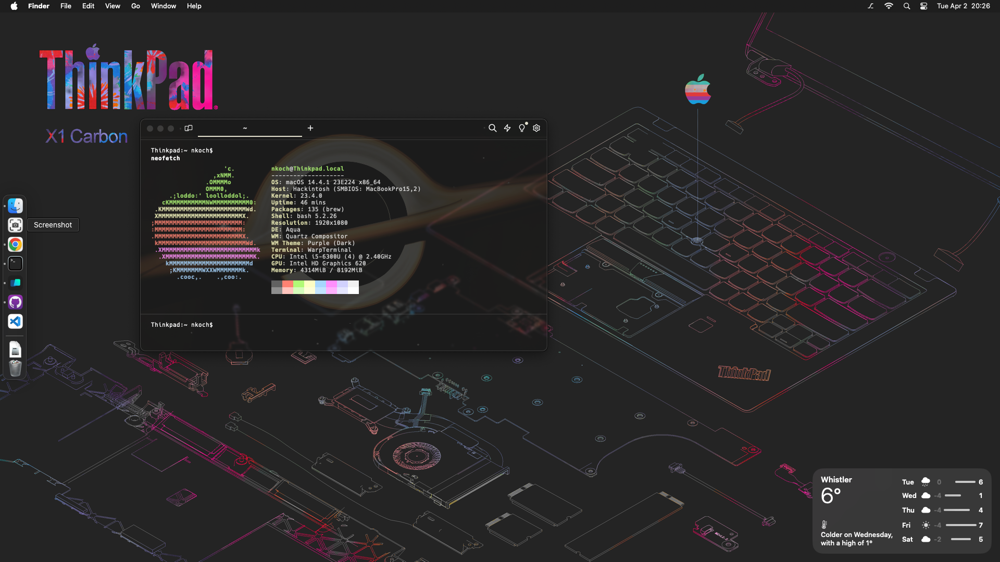
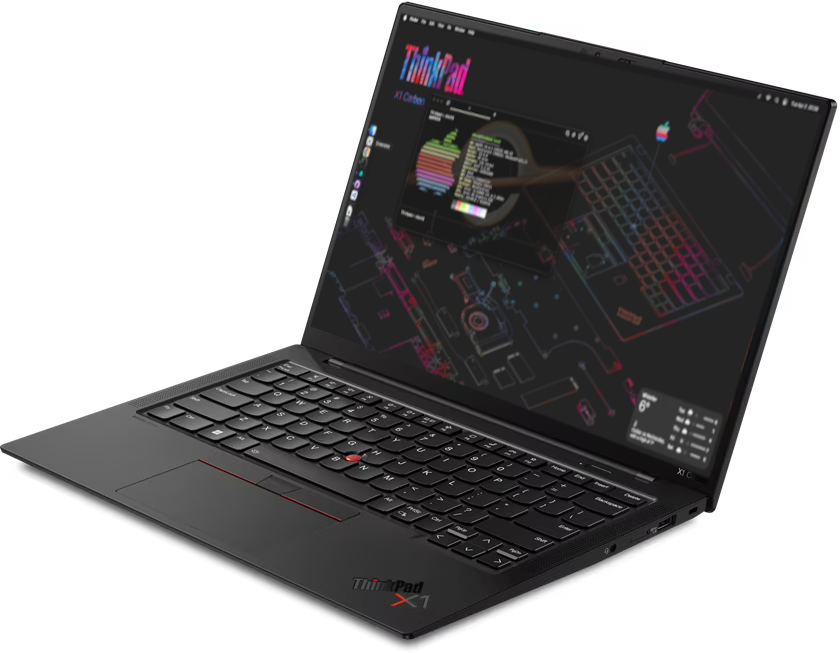

# macOS on Thinkpad X1 Carbon 5th Generation, Model 20K4\*

[](https://github.com/996icu/996.ICU/blob/master/LICENSE)
[](https://github.com/996icu/996.ICU/blob/master/LICENSE)
[](https://github.com/996icu/996.ICU/blob/master/LICENSE)
[](https://github.com/996icu/996.ICU/blob/master/LICENSE)
[](https://github.com/996icu/996.ICU/blob/master/LICENSE)
[](https://github.com/996icu/996.ICU/blob/master/LICENSE)


> ## SUMMARY:
*In short, x1c5-hackintosh is very stable and is currently my daily driver. I quad boot on this machine with Linux, FreeBSD, Windows, MacOS and all provide an enjoyable experience. Overall macOS works fine on this machine.*

<a href="https://github.com/anathonous/lenovo-grub-gentoo-theme"></a>

> ## NEEDED:

A macOS machine is needed to: Create install drives. A usb key for Opencore and a usb key for macOS Installer.

> ## INSTALL:
Create a bootable EFI drive (format a drive as fat32). Copy over the OpenCore(EFI) files.<br>
Create a bootable macOS install. On a Mac. Download 14.3.1. Using [gibMacOS](https://github.com/corpnewt/gibMacOS). Install the InstallAssistant.pkg. Show files on macOS Install Sonoma.app. [createinstallmedia](https://support.apple.com/en-us/101578) on a 32GB flashdrive. <br>
Install Sonoma 14.3.1. May take several reboots. <br>
Done.<br>

>## UPDATE:
If you edit your opencore config.plist and change SecureBootModel from Defaults to Disabled. You will need to Reset NVRam and Clearn NVRAM afterwards. Then you can rerun the macOS Install Sonoma.app after downloading the InstallAssistant.pkg for 14.4.1 using gibMacOS and it will update to Sonoma 14.4.1. It will reboot a few times during the update. Then the second option for macOS update will disapear. You will need to change it back and update Airportitlwm.kext though. As they do not Jive. Download the [latest wifi](https://github.com/OpenIntelWireless/itlwm/releases/download/v2.3.0-alpha/AirportItlwm-Sonoma14.4-v2.3.0-DEBUG-alpha-e886ebb.zip) and update the three bluetooth related kexts [latest bluetooth](https://github.com/acidanthera/BrcmPatchRAM/releases)

>## UPDATE 2:
Updated to be able to do a clean install to 14.4.1 from USB Key. Download Release 2. If having bluetooth issues install sleepwatcher and install restartbt to /etc/rc.wake.

>## UPDATE 3:
Updated to Sequoia. Download Release 3. Wifi will work with [Heliport](https://github.com/OpenIntelWireless/HeliPort).

> ## MY SPECIFICATIONS:

Refer to [x1c5-Platform_Specifications](https://github.com/B0hrer/thinkpad-x1c5-hackintosh/blob/master/docs/ThinkPad_X1_Carbon_5th_Gen_Spec.PDF) for possible stock ThinkPad X1 5th Gen configurations.

| Processor Number                                                                                                                   | # of Cores | # of Threads | Base Frequency | Max Turbo Frequency | Cache | Memory Types | Graphics      |
| :--------------------------------------------------------------------------------------------------------------------------------- | :--------- | :----------- | :------------- | :------------------ | :---- | :----------- | :------------ |
| [i5-6300U](https://ark.intel.com/content/www/us/en/ark/products/88190/intel-core-i5-6300u-processor-3m-cache-up-to-3-00-ghz.html) | 2          | 4            | 2.4 GHz        | 3.0 GHz             | 3 MB  | LPDDR3-1866  | Intel UHD 520 |

**Peripherals:**

```
Two USB 3.1 Gen 1 (Right USB Always On)
Two USB 3.1 Type-C Gen 2 / Thunderbolt 3 (Max 5120x2880 @60Hz)
HDMI 1.4b (Max 4096x2160 @30Hz)
Ethernet via ThinkPad Ethernet Extension Cable Gen 2: I219-LM Ethernet (vPro)
No WWAN
TrackPoint: PS/2
TrackPad: ELAN
```

**Display:**  14.0" (355mm) FHD IPS (1920x1080)<br>
**Audio:**  CX11871 Audio Codec<br>
**Thunderbolt:**  Intel JHL6540 (Alpine Ridge 4C) Thunderbolt 3 Bridge

> ## Read These (References):

- [dortania Hackintosh guides](https://github.com/dortania)
- [The Vanilla Laptop Guide](https://fewtarius.gitbook.io/laptopguide/)

> ## Credits and Thank You:

[@tylernguyen](https://github.com/tylernguyen/x1c6-hackintos)

Attn: Following configuration will likely run on any Lenovo product based on Skylake with a Intel graphics card. May require some tweaking.
